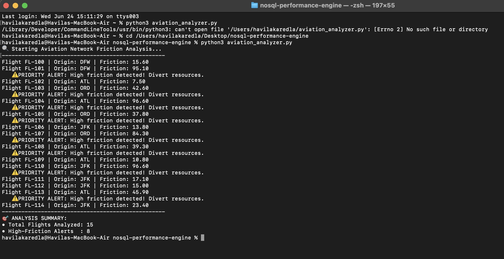

# Aviation Network Resilience Engine

**What this does:** This tool automates the identification of high-risk flights that are likely to cause cascading delays. It helps operations teams intervene before minor delays become expensive operational failures.

**How to run it:**
1. Run the data generator: `python3 aviation_generator.py`
2. Run the analyzer: `python3 aviation_analyzer.py`

**The Result:**
The analyzer outputs a "Friction Index" report, highlighting which flights need immediate attention.

