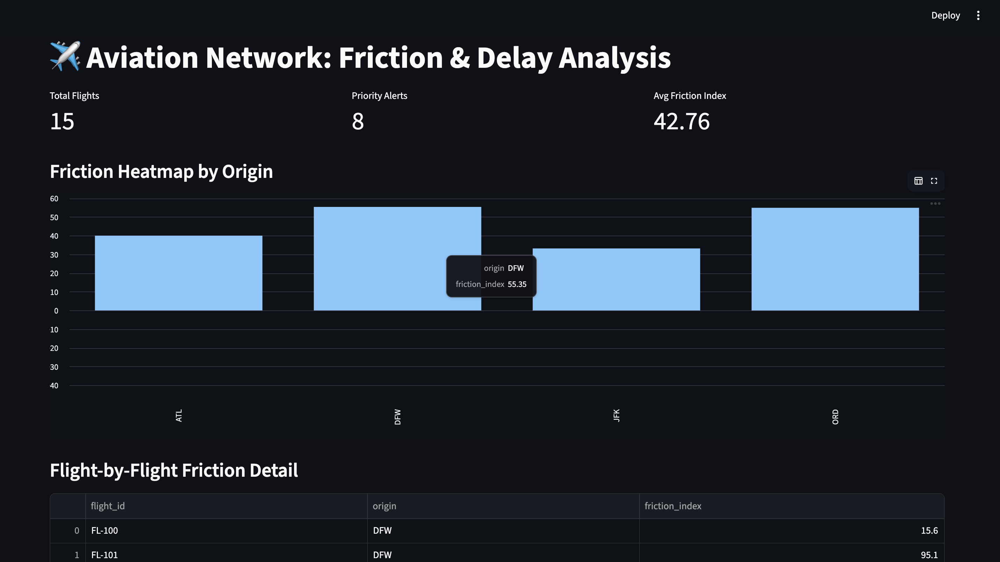

# Aviation Network Resilience Engine

**What this does:** This tool automates the identification of high-risk flights that are likely to cause cascading delays. It helps operations teams intervene before minor delays become expensive operational failures.

**How to run it:**
1. Run the data generator: `python3 aviation_generator.py`
2. Run the analyzer: `python3 aviation_analyzer.py`

**The Result:**
The analyzer outputs a "Friction Index" report, highlighting which flights need immediate attention.


## Aviation Operational Command Dashboard
An interactive dashboard built with Streamlit to visualize the "Friction Index" across our flight network. This tool helps operational leaders identify bottlenecks and prioritize resource diversion in real-time.

### Key Features
* **Friction Analytics:** Calculates the ratio of delays vs. tight connections.
* **Proactive Alerting:** Automatically identifies "High Friction" flights.
* **Network Heatmap:** Visualizes friction distribution by origin point.



### How to Run the Dashboard
1. Ensure your MongoDB service is active.
2. From the root directory, launch the dashboard:
   ```bash
   PYTHONPATH=. python3 -m streamlit run aviation_project/aviation_dashboard.py