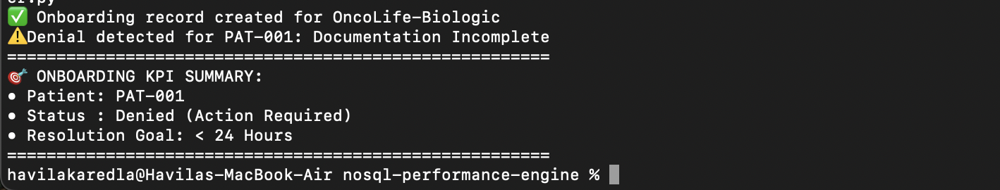
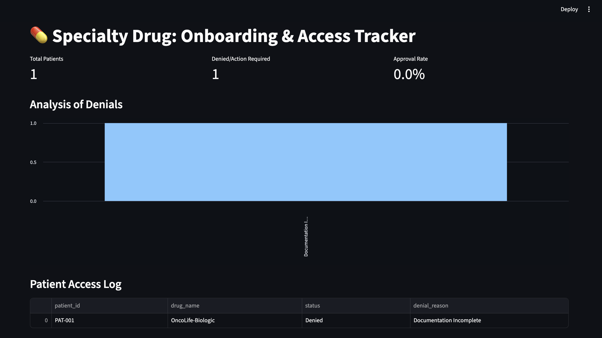

# Clinical Access Optimizer

## Executive Summary
This project optimizes the high-friction specialty drug onboarding process. By automatically classifying insurance denial reasons, it reduces the administrative burden on clinical staff and minimizes "time-to-treatment" for patients requiring complex biologic therapies.

## Analytical Methodology
The system integrates an automated **Denial Reason Extraction** engine that parses unstructured rejection letters. It categorizes denials into actionable pathways (e.g., "Documentation Incomplete" vs. "Auth Required"), triggering immediate remedial workflows.

## Business Impact
* **KPI Optimization:** Tracks the "Time-to-Resolution," with a target of sub-24-hour turnaround for denied claims.
* **Operational Efficiency:** Reduces manual case review time by auto-routing denials based on intelligent text classification.
* **Patient Advocacy:** Increases therapy adherence by accelerating the patient's transition from "Denied" to "On-Treatment."

## How to Run
1. Ensure your MongoDB instance is running.
2. From the project root, execute the optimizer script:
   ```bash
   python3 clinical-access-optimizer/clinical-access-optimizer.py

## KPI Performance Output


# Specialty Drug Onboarding & Access Tracker dashboard 

### Architecture Overview
* **Data Engine:** Uses a custom `DBConnector` to manage onboarding funnels in MongoDB.
* **Intelligent Analysis:** Processes unstructured denial letters to categorize reasons (e.g., "Documentation Incomplete" vs. "Auth Required").
* **Visualization Layer:** A Streamlit-based dashboard for real-time monitoring of patient access status and denial trends.



### How to Run the Dashboard
Ensure your MongoDB service is running, then from the root directory (`nosql-performance-engine`), execute:

```bash
PYTHONPATH=. python3 -m streamlit run clinical-access-optimizer/access_dashboard.py