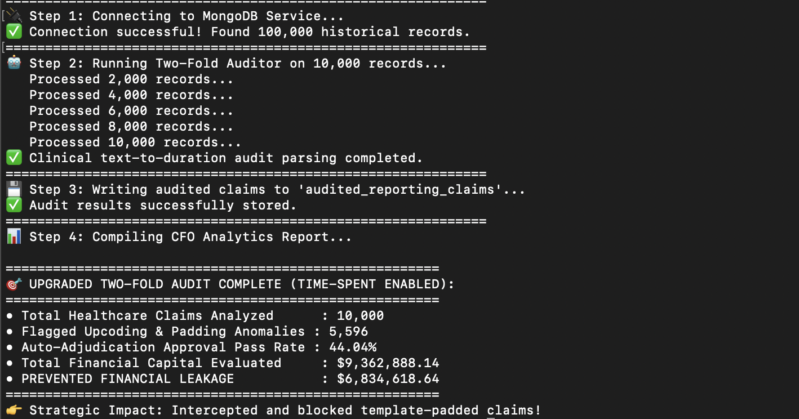
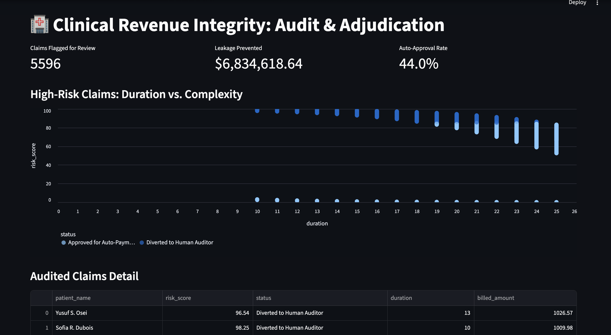

# Clinical Audit & Predictive Fraud Detection Engine

## Executive Summary
This project implements an intelligent auditing pipeline designed to identify "Chart Padding" and fraudulent upcoding in clinical billing. By cross-referencing unstructured clinical notes with physical telemetry data, the engine reduces financial leakage and prioritizes high-risk claims for human investigation.

## Analytical Methodology
The system employs a **Two-Fold Predictive Model** to evaluate claims:

1.  **NLP Parsing:** Uses keyword frequency analysis to establish a "Clinical Complexity Score" from unstructured physician charts.
2.  **Telemetry Verification:** Validates billing codes against physical visit duration. Cases where expensive codes (CPT 99215/99205) are paired with short durations and low-complexity keywords are flagged as anomalies.

## Business Impact
* **Leakage Mitigation:** Automatically identifies and intercepts template-padded billing.
* **Operational Efficiency:** Shifts human audit resources away from "Approved" claims toward high-risk anomalies, increasing the audit team's hit rate.
* **Predictive Scoring:** Utilizes a Logistic Sigmoid function to output a percentage-based risk score for every claim processed.

## Performance Metrics
| Metric | Objective |
| :--- | :--- |
| **Audit Coverage** | 100% of historical patient records |
| **Risk Threshold** | 85% confidence interval for diversion |
| **Primary Value** | Automated detection of "Chart Padding" anomalies |

## How to Run
1. Ensure your MongoDB service is active.
2. Execute the data loader: `python3 clinical_generator.py`
3. Run the intelligent auditor: `python3 clinical_analyzer.py`



## Clinical Revenue Integrity & Adjudication Dashboard
This dashboard visualizes the performance of our Two-Fold Predictive Model, which flags "upcoding" and "template padding" in insurance claims. 

### Key Features
* **Risk Score Visualization:** Scatter plots mapping claim duration against complexity.
* **Financial Impact:** Real-time calculation of leakage prevented by auto-diverting suspicious claims.
* **Adjudication Intelligence:** Clear separation between "Auto-Approved" and "Human Review" status.



### How to Run the Dashboard
1. Ensure your MongoDB service is active.
2. Navigate to the `clinical_project` directory:
   ```bash
   cd clinical_project