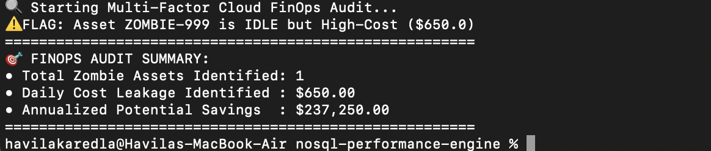
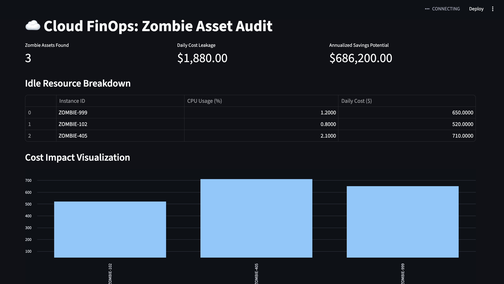

# Cloud FinOps Multi-Factor Optimizer

## Executive Summary
This project provides an automated auditing solution for cloud infrastructure, specifically designed to identify and quantify "Zombie" assets. By cross-referencing resource metadata with real-time operational telemetry, it flags idle high-cost resources that are leaking budget.

## Analytical Methodology
The system utilizes a multi-factor logic engine to isolate waste:
* **Metric 1:** Low utilization threshold (`CPU < 5.0%`).
* **Metric 2:** High cost impact (`Daily Cost > $500.00`).
* **Aggregation:** Identifies the specific footprint of idle "Production-Critical" assets to prioritize cleanup efforts.

## Business Impact
* **Cost Leakage Identification:** Instantly flags over-provisioned or orphaned cloud instances.
* **Proactive FinOps:** Enables engineering teams to transition from reactive cost-reporting to proactive, automated cost-mitigation.
* **Annualized Savings:** Projects annual savings based on identified daily wastage, providing a clear ROI for infrastructure optimization.

## How to Run
1. Ensure your MongoDB instance is running.
2. Execute the optimizer script:
   ```bash
   python3 finops_audit/finops_optimizer.py

## Audit Performance Output


## Executive Dashboard
The system includes an interactive Streamlit dashboard for real-time FinOps monitoring. It provides instant visibility into:
* **KPIs:** Total cost leakage and potential annual savings.
* **Visualization:** Comparative bar charts identifying highest-impact zombie assets.



## How to Run the Dashboard
1. Ensure your MongoDB instance is active.
2. Execute the dashboard:
   ```bash
   python3 -m streamlit run finops_audit/dashboard.py