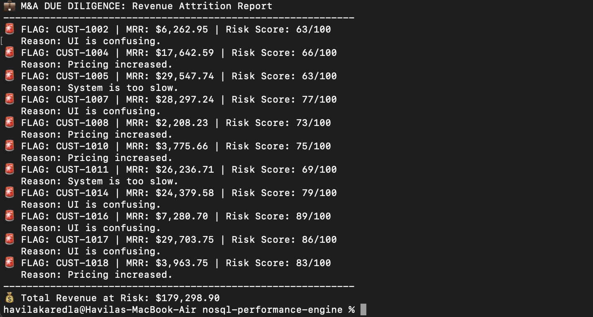

# M&A Due Diligence: Revenue Attrition Analyzer

## Executive Summary
This engine automates the pre-acquisition risk assessment process. By analyzing customer support logs against monthly recurring revenue (MRR), the tool identifies "At-Risk" accounts that could lead to post-merger revenue attrition.

## Analytical Methodology
The tool evaluates customer health based on a proprietary **Risk Score** (0-100 scale). It performs a deep dive into support sentiment to categorize account stability.

## Business Impact
* **Deal Valuation:** Quantifies "Total Revenue at Risk," allowing firms to adjust acquisition valuations based on actual attrition probability.
* **Risk Prioritization:** Flags specific accounts with high MRR and high risk scores, providing actionable insights for post-merger integration teams.
* **Operational Transparency:** Replaces manual spreadsheet audits with a real-time, reproducible analytical pipeline.

## How to Run
1. Ensure your MongoDB service is active.
2. Run the generator: `python3 ma_generator.py`
3. Run the analyzer: `python3 ma_analyzer.py`

