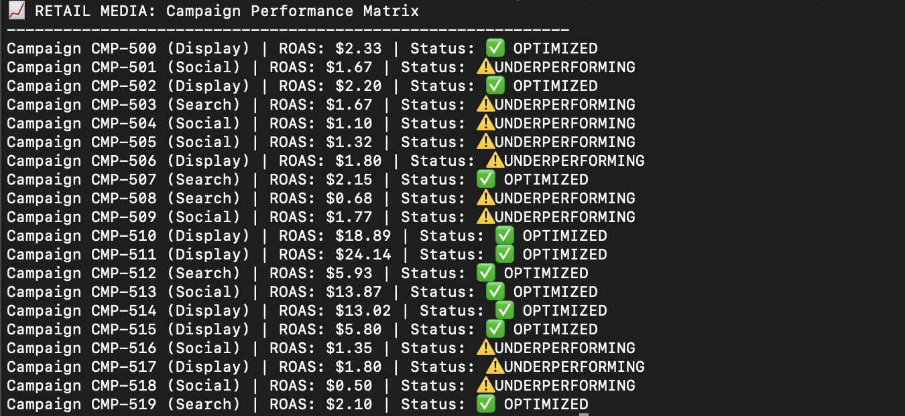

# Retail Media Performance Engine

#### The Business Logic
I engineered a performance matrix that translates raw digital ad spend into actionable business intelligence. The core logic calculates the Return on Ad Spend (ROAS) using the following formula:

ROAS = (Checkout Lift * 100,000) / Digital Ad Spend

The script applies a logic gate to categorize campaigns into either "Optimized" or "Underperforming" based on a 2.0x threshold, allowing operations teams to instantly identify and mitigate revenue leakage.

**How to run it:**
1. Run the data generator: `python3 retail_generator.py`
2. Run the analyzer: `python3 retail_analyzer.py`

**The Result:**
The analyzer generates a performance report highlighting ROAS (Return on Ad Spend) anomalies.

